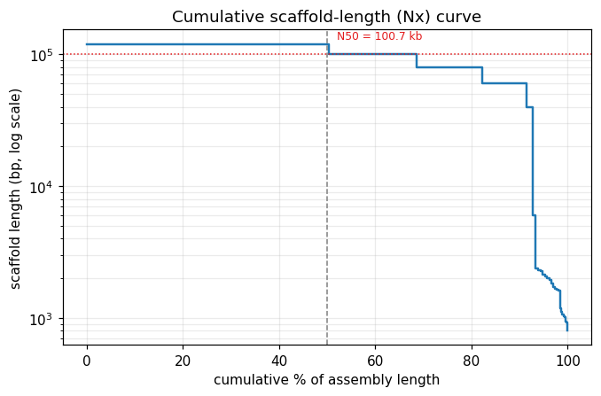
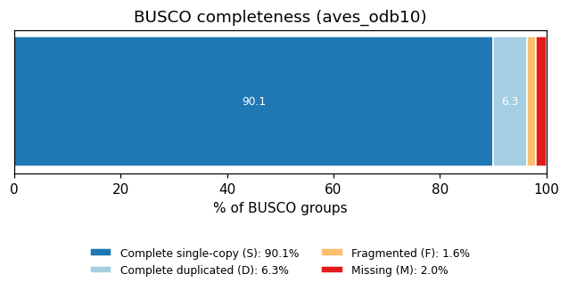
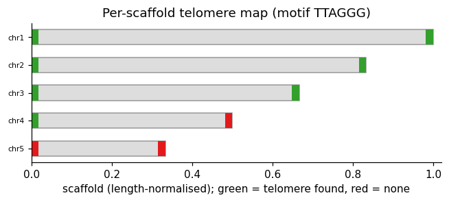
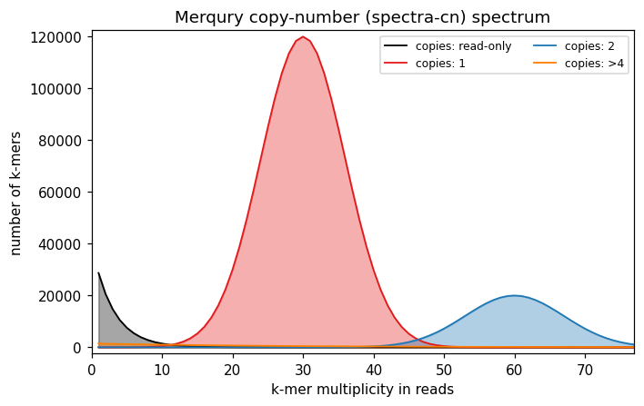

# AsmQC — genome-assembly QC, consolidated and explained

**AsmQC** takes the scattered outputs of the tools you already run on a new genome
assembly — Merqury, BUSCO, QUAST/gfastats, tidk, FCS-GX/Kraken2 — and folds them
into **one interpretable report** (`report.html`, `report.md`, `summary.json`) with
**automated curation flags**. Every flag comes with a plain-English explanation of
the *likely cause* and the *curation action* to take, so a report is readable by
someone who has never run an assembly pipeline.

It degrades gracefully: give it whatever you have. With nothing but a FASTA it
computes contiguity stats itself; add a BUSCO summary and it scores completeness;
add Merqury and it scores consensus accuracy; and so on.

> **New to assembly QC?** Jump to [Reading an assembly report](#reading-an-assembly-report-a-field-guide) —
> it explains every metric, what *good* vs *bad* looks like, and shows annotated
> example plots.

[](https://github.com/example/asmqc/actions/workflows/ci.yml)
&nbsp;License: **GPL-3.0-or-later**

---

## Contents

- [Install](#install)
- [Quickstart](#quickstart)
- [What AsmQC ingests](#what-asmqc-ingests)
- [Reading an assembly report: a field guide](#reading-an-assembly-report-a-field-guide)
  - [The 3 C's](#the-3-cs-the-mental-model)
  - [Contiguity: N50, L50, contigs vs scaffolds, gaps](#1-contiguity--how-broken-is-it)
  - [Completeness: BUSCO + k-mer completeness + telomeres](#2-completeness--is-all-the-genome-there)
  - [Correctness: Merqury QV + contamination](#3-correctness--is-what-is-there-right)
- [Curation flags reference](#curation-flags-reference)
- [Outputs](#outputs)
- [Browser tracks (GFF/BED + JBrowse2)](#browser-tracks-gffbed--jbrowse2)
- [Configuring thresholds](#configuring-thresholds)
- [Cookbook: real assemblies](#cookbook-real-assemblies)
- [Repository layout](#repository-layout)
- [Development](#development)
- [How AsmQC parses each format](#how-asmqc-parses-each-format)
- [License & citation](#license--citation)

---

## Install

```bash
git clone https://github.com/example/asmqc
cd asmqc
python -m pip install -e .          # core (PyYAML, matplotlib, numpy)
python -m pip install -e ".[fasta]" # optional: pyfaidx + biopython for indexed FASTA
python -m pip install -e ".[dev]"   # tests + ruff
```

Requires Python ≥ 3.9. The only hard dependencies are PyYAML, matplotlib and numpy.

## Quickstart

```bash
# Everything you have, into report/
asmqc run \
  --fasta assembly.fasta \
  --busco busco/short_summary.specific.aves_odb10.asm.txt \
  --merqury merqury_out/ \
  --tidk tidk/asm_telomeric_repeat_windows.tsv \
  --contamination fcs/assembly.fcs_gx_report.txt \
  --out report/ --jbrowse

# Minimal: just a FASTA (AsmQC computes N50/L50/gaps itself)
asmqc run --fasta assembly.fasta --out report/

# Use QUAST instead of computing contiguity from the FASTA
asmqc run --fasta assembly.fasta --quast quast/report.tsv --out report/

# Print the default thresholds, edit, and feed back in
asmqc init-config > thresholds.yaml
asmqc run --fasta assembly.fasta --config thresholds.yaml --out report/
```

`asmqc run` prints a console summary and writes `report.html`, `report.md` and
`summary.json` (plus `flags.gff3`/`flags.bed`/`jbrowse2_config.json` with `--tracks`/`--jbrowse`).

## What AsmQC ingests

| Input | Flag | Native format AsmQC reads | What it scores |
| --- | --- | --- | --- |
| Assembly FASTA | `--fasta` | `.fa/.fasta/.fna[.gz]` | Contiguity (N50/N90/L50/L90, contigs, gaps) |
| BUSCO | `--busco` | `short_summary.*.txt` **or** `.json` | Gene-space completeness & duplication |
| Merqury | `--merqury` | `.qv`, `.completeness.stats`, `.spectra-cn.hist` (dir/prefix/file) | Consensus QV, k-mer completeness, copy-number spectrum |
| QUAST | `--quast` | `report.tsv` (or QUAST dir) | Contiguity (authoritative, if supplied) |
| gfastats | `--gfastats` | default summary stdout | Contiguity incl. gap counts |
| tidk | `--tidk` | `*_telomeric_repeat_windows.tsv` | Telomere presence per scaffold end |
| FCS-GX | `--contamination` | `*.fcs_gx_report.txt` | Foreign-sequence contamination (with coordinates) |
| Kraken2 | `--contamination` | standard `*.kreport` | Contaminant superkingdom signal |

Missing inputs are simply skipped — the report shows what could be computed.

---

## Reading an assembly report: a field guide

This section is the pedagogical heart of AsmQC. If you can read this, you can read
an AsmQC report.

### The 3 C's (the mental model)

Modern genome projects (Earth BioGenome Project, Vertebrate Genomes Project) judge
an assembly on **three axes**, the *3 C's*:

| C | Question | Tools | "Good" bar (EBP/VGP) |
| --- | --- | --- | --- |
| **Contiguity** | How long are the pieces? | N50, QUAST, gfastats | Contig N50 ≥ 1 Mb, scaffolds chromosome-scale |
| **Completeness** | Is all the genome there? | BUSCO, Merqury k-mers, telomeres | BUSCO ≥ 95% complete, k-mer completeness ≥ 90% |
| **Correctness** | Is what's there *right*? | Merqury QV, FCS/Kraken | QV ≥ 40 (99.99%), no contamination |

EBP writes this as a code like **`6.7.Q40`**: contig N50 ≥ 10⁶ bp (the `6`),
scaffold N50 ≥ 10⁷ bp (the `7`), and Merqury QV ≥ 40. The aspirational
telomere-to-telomere tier is `C.C.Q60` — gapless, every chromosome capped by
telomeres, QV ≥ 60. AsmQC's default thresholds encode exactly these bars.

### 1. Contiguity — how broken is it?

An assembly is delivered as **sequences** in a FASTA. Two kinds matter:

- **Contig** — a continuous run of sequence with no gaps.
- **Scaffold** — one or more contigs joined by **gaps** (runs of `N`) where
  long-range data (Hi-C, optical maps) says "these contigs are adjacent, but we
  don't know the exact bases between them".

**N50** is the single most-quoted contiguity number: *sort sequences longest-first;
N50 is the length of the sequence at which the running total first passes 50% of the
assembly.* Half the genome sits in sequences this long **or longer**. Bigger = more
contiguous. **L50** is the *count* of sequences needed to reach that 50% — small
L50 (a handful) means a few big chromosomes; large L50 (thousands) means a sea of
fragments. **N90/L90** apply the same idea at 90% and expose the long tail of small
sequences.

The **cumulative (Nx) curve** below shows this at a glance. The y-axis is sequence
length (log); the x-axis is cumulative % of the assembly. A good assembly is a high,
flat plateau that only falls off near 100%. The cliff on the right of this example is
the short-scaffold "debris" — exactly what the *fragmentation* flag catches.



| Metric | Good | Bad | Why |
| --- | --- | --- | --- |
| Scaffold N50 | chromosome-scale (often ≥ 10 Mb) | < 1 Mb | Low N50 = a fragmented draft, not a reference |
| Contig N50 | ≥ 1 Mb | < 100 kb | Short contigs = unresolved repeats / short reads |
| L50 | a few | thousands | Large L50 means no chromosome structure |
| Gaps | few (T2T = 0) | many | Each gap is unknown sequence and a place errors hide |
| # sequences | ~chromosome count + a little | tens of thousands | A huge count signals debris/haplotigs/contamination |

> **Gotcha:** N50 is not comparable across genomes of different size — a 1 Mb N50 is
> excellent for a bacterium and poor for a vertebrate. EBP uses **NG50** (normalised
> to genome size) for cross-species comparison. AsmQC reports N50 and lets you set
> size-appropriate thresholds in the config.

### 2. Completeness — is all the genome there?

**BUSCO** asks: of the genes that should appear *exactly once* in this lineage, how
many are present and intact? It bins every benchmarking gene as **S** (complete,
single-copy — good), **D** (complete but **duplicated**), **F** (fragmented), or
**M** (missing). Complete = S + D.



- **High S** → gene space is complete. Aim for Complete ≥ 95%.
- **High D (duplicated)** → the assembly is probably carrying **both haplotypes** of
  a diploid genome where it should carry one ("uncollapsed haplotigs"). Over ~5%
  duplicated is the classic signature of a failed `purge_dups`. (It *can* be real
  biology — a recent whole-genome duplication — which is why AsmQC flags it as a
  *warning* to investigate, not a hard failure.)
- **High F + M** → genes are broken across contig boundaries or genuinely absent;
  this tracks low contiguity and low coverage.

**Merqury k-mer completeness** complements BUSCO. BUSCO only sees *genes*; k-mer
completeness asks what fraction of the reliable k-mers *in your reads* made it into
the assembly — capturing repeats and intergenic sequence too. Below ~90% means real
sequence (often one haplotype, or collapsed repeats) is missing.

**Telomeres** are the third completeness signal. A chromosome is only truly complete
when assembled from one telomere to the other (**T2T**). `tidk` counts the telomeric
repeat motif (e.g. vertebrate `TTAGGG`) in windows along each scaffold; a spike at a
scaffold end means a telomere is present there. AsmQC turns this into a
**per-scaffold telomere map**: green caps = telomere found, red = missing.



Here chr1–chr3 are telomere-to-telomere; chr4 has one end; chr5 has neither — so
this assembly is **not yet T2T**, which AsmQC notes.

### 3. Correctness — is what's there *right*?

**Merqury QV** is a reference-free estimate of per-base accuracy. It finds k-mers
that occur in the **assembly but not the reads** (assumed to be errors), and converts
the error rate to a Phred score: **Q30 = 99.9%** (1 error / 1,000 bp), **Q40 = 99.99%**
(1 / 10,000 bp — the EBP standard), **Q50 = 99.999%**, **Q60 = T2T-grade**. Q40 is the
chosen bar because an average gene is ~1–2 kb, so below ~1 error/10 kb most genes
carry a base error.

The **k-mer copy-number (spectra-cn) spectrum** is the picture behind QV and
completeness. The x-axis is how often a k-mer appears in the reads (≈ sequencing
depth); colours are how often that k-mer appears in the **assembly**:



- The big **red (1-copy)** peak at sequencing depth is the genome assembled once —
  what you want.
- A **black "read-only" peak near zero** = k-mers in the reads but *missing* from the
  assembly (dropped sequence / collapsed haplotype).
- A **blue (2-copy)** bump where there should be one copy = sequence duplicated in the
  assembly (uncollapsed haplotigs) — the same story BUSCO duplication tells.
- An **error peak** at very low multiplicity (k-mers seen once in the reads) maps to
  consensus errors and drags QV down.

**Contamination.** Assemblies routinely pick up bacterial contigs, the wrong host,
adaptors, or organelle sequence. **NCBI FCS-GX** reports exact spans to `EXCLUDE`,
`TRIM` or `REVIEW`, with the foreign taxon; **Kraken2** gives a read/k-mer-level
superkingdom breakdown. AsmQC flags both, and (for FCS) exports the exact coordinates
as a browser track so you can inspect before deleting.

---

## Curation flags reference

Each flag has a **severity** — `PASS` < `INFO` < `NOTE` < `WARN` < `FLAG` < `FAIL`
— and the report's overall status is the worst flag present.

| Flag id | Fires when (default) | Severity | Curation meaning |
| --- | --- | --- | --- |
| `busco_duplication` | BUSCO D > 5% (FLAG at >10%) | WARN/FLAG | Uncollapsed haplotigs → run purge_dups |
| `busco_completeness` | BUSCO C < 95% (FLAG at <90%) | WARN/FLAG | Missing/broken genes → coverage or re-assembly |
| `busco_fragmented` | BUSCO F ≥ 5% | WARN | Genes split across contigs → improve contiguity |
| `busco_missing` | BUSCO M ≥ 5% | WARN | Absent genes or wrong lineage dataset |
| `merqury_qv` | QV < 40 (FLAG at <30) | WARN/FLAG | Residual base errors → polish consensus |
| `merqury_completeness` | k-mer completeness < 90% | WARN | Missing sequence → check coverage/haplotype |
| `contiguity_scaffold_n50` | scaffold N50 < 1 Mb (NOTE < 10 Mb) | WARN/NOTE | Fragmented draft → scaffold with Hi-C |
| `contiguity_contig_n50` | contig N50 < 100 kb (NOTE < 1 Mb) | WARN/NOTE | Short contigs → longer reads / re-assemble |
| `contiguity_fragmentation` | > 10% of length in short scaffolds | WARN | Debris/haplotigs/contamination → purge & screen |
| `contiguity_many_sequences` | ≥ 1000 sequences | NOTE | Smell of fragmentation/duplication |
| `gaps_density` | high gaps/100 kb or > 5% N | NOTE/WARN | Unfilled joins → gap-fill, validate with Hi-C |
| `telomere_t2t` | < 90% chromosomes capped both ends | NOTE | Not yet T2T → target missing ends |
| `telomere_low` | < 50% chromosomes have any telomere | WARN | Check the motif, then chase missing ends |
| `contamination_fcs` | any EXCLUDE/TRIM span | FLAG | Remove/trim foreign sequence (coords exported) |
| `contamination_kraken` | non-target superkingdom ≥ 1% | FLAG | Confirm and remove contaminant contigs |

All thresholds are configurable (see [below](#configuring-thresholds)).

## Outputs

```
report/
├── report.html            # self-contained: embedded CSS + base64 figures, no external assets
├── report.md              # same content as Markdown (diff-friendly, PR-able)
├── summary.json           # machine-readable: every metric + every flag
├── flags.gff3             # (with --tracks) flagged regions, 1-based
├── flags.bed              # (with --tracks) flagged regions, 0-based, coloured by type
└── jbrowse2_config.json   # (with --jbrowse) ready-to-load browser session
```

`summary.json` is stable and CI-friendly — assert on `overall_status`, `flag_counts`,
or any metric in your own pipeline. For pipeline gating, `asmqc run --fail-on FLAG …`
exits non-zero when the overall status reaches the given severity (a successful run is
otherwise always exit 0 — flags are *data*, not program errors).

## Browser tracks (GFF/BED + JBrowse2)

With `--tracks`/`--jbrowse`, AsmQC writes the **located** flags — FCS contamination
spans, telomere arrays, and assembly gaps (recovered from the FASTA) — as a GFF3/BED
track plus a JBrowse2 config, so a reviewer can inspect flagged regions *in the
genome browser, alongside the assembly*:

```bash
asmqc run --fasta assembly.fasta --contamination fcs_report.txt --tidk windows.tsv \
          --out report/ --jbrowse
samtools faidx assembly.fasta          # JBrowse needs the .fai index
# load report/jbrowse2_config.json in JBrowse2 (jbrowse web / desktop)
```

## Configuring thresholds

```bash
asmqc init-config > thresholds.yaml    # fully commented defaults
```

Every threshold is documented inline and grounded in the EBP/VGP standards. The file
is **deep-merged** over the defaults, so you only set what you change:

```yaml
# thresholds.yaml — only override what differs from defaults
merqury:
  qv_warn: 50          # demand Q50 instead of Q40
contiguity:
  scaffold_n50_warn_bp: 10000000   # expect chromosome-scale scaffolds
enabled:
  contamination: false # skip the contamination family entirely
```

## Cookbook: real assemblies

[`cookbook/`](cookbook/) walks through AsmQC on **two real, published, non-model
genomes** from NCBI:

- **[Rock Ptarmigan](cookbook/01_rock_ptarmigan_good/)** (*Lagopus muta*,
  `GCA_023343835.1`) — a VGP chromosome-level reference: what *passing* QC looks like.
- **[Philippine tarsier](cookbook/02_philippine_tarsier_draft/)** (*Carlito syrichta*,
  `GCA_000164805.2`) — a fragmented 2013 short-read draft: how the flags catch low
  contiguity and degraded completeness.

Each case has the QC inputs, a `make.sh`, the generated report, and a narration of
exactly what each flag caught and why.

## Repository layout

```
src/asmqc/
├── models.py          # typed data containers (the contract between modules)
├── config.py          # YAML thresholds + deep-merge
├── fasta_stats.py     # N50/N90/L50/auN, gaps, contig/scaffold from FASTA
├── parsers/           # one module per tool: busco, merqury, quast, gfastats, tidk, contamination
├── flags.py           # the curation-flag heuristics
├── explanations.py    # plain-English cause + action per flag
├── plots.py           # matplotlib figures -> base64
├── report.py          # HTML / Markdown / JSON writers
├── exporters/         # GFF3/BED + JBrowse2
├── core.py            # orchestration (parse -> stats -> flags -> write)
└── cli.py             # argparse entry point
tests/                 # pytest + synthetic fixtures for every parser/engine
docs/                  # metrics & flag references, architecture
examples/              # synthetic dataset + generated report + figures
cookbook/              # worked examples on real published assemblies
```

## Development

```bash
python -m pip install -e ".[dev]"
python -m pytest            # 53 tests, synthetic fixtures for every parser
python -m ruff check src tests
python examples/make_example.py   # regenerate the example report + figures
```

CI (GitHub Actions) runs ruff + pytest across Python 3.9–3.12 on Linux, plus macOS
and Windows, and smoke-tests the CLI.

## How AsmQC parses each format

The parsers are written against the tools' actual output formats (verified against
each tool's source). See [`docs/formats.md`](docs/formats.md) for the exact column
layouts AsmQC relies on, and [`docs/metrics.md`](docs/metrics.md) for the deeper
metrics reference.

## License & citation

AsmQC is free software under the **GNU General Public License v3.0 or later**
([`LICENSE`](LICENSE)). You may redistribute and/or modify it under those terms; it
comes with **no warranty**.

Thresholds and the 3C framework follow:

- Lawniczak, Lewin et al. (2022) *Standards recommendations for the Earth BioGenome
  Project.* PNAS 119(4):e2115639118.
- Rhie et al. (2021) *Towards complete and error-free genome assemblies of all
  vertebrate species (VGP).* Nature 592:737–746.
- Rhie et al. (2020) *Merqury: reference-free quality, completeness, and phasing
  assessment.* Genome Biology 21:245.
- Manni et al. (2021) *BUSCO: Assessing Genomic Data Quality and Beyond.* Current
  Protocols.
